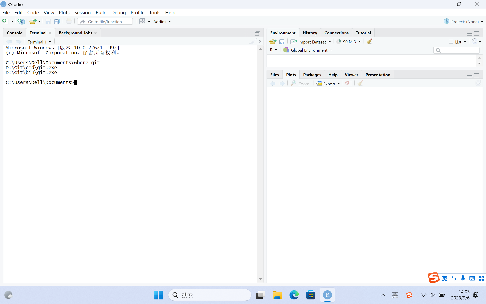
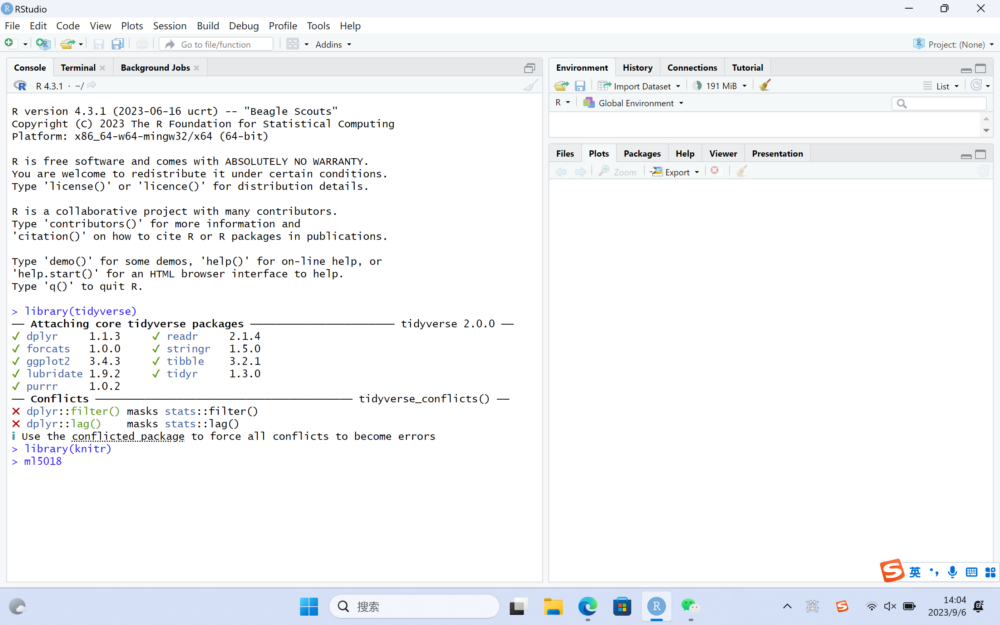

# This is Jeff's awesome website

Here's a gif of eimo


you can add text

* and list
* with extra bullets

You can *FORMAT* and **bold?**

You can also still use R!

This is a [link](https://www.google.com/) to a good data science tool. Here's a link to [p8105](https://p8105.com). Here's a link to the [about](about.html) page.

```{r}
library(tidyverse)
plot_df = tibble(
  x = runif(100),
  y = 1 + 2 * x + rnorm(100)
)
  
plot_df |>
  ggplot(aes(x = x, y = y)) +
  geom_point()
```

# Here's a new section

My cat is ted. This is ted:



Also here's the "backstage" are in Alumni Auditorium:



# Other stuff on this page

Definitely there is [plotly](plotly.html) stuff!